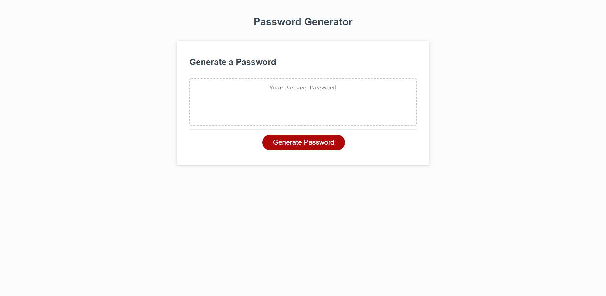

# <Password Generator Starter Code>

## Description

Provide a short description explaining the what, why, and how of your project. Use the following questions as a guide:

- What was your motivation? 
My motiavtion for this project was to able to understand the concepts of JavaScript better. I know feel that I'm confident enough with JavaScipt for now.

- Why did you build this project? (Note: the answer is not "Because it was a homework assignment.")
I builded this prohject because I wanted to know how to create a password generator. 

- What problem does it solve?
The program solves multiple problems. From first creating the function for GeneratePassword becuase it was not defined. After that 
I writing the condition that opens the prompt window. 

- What did you learn?
I learned that stackoverflow is very helpful tool. It provides a user with a lot of resources. In addition I also learned that looking in the console option to know where the error is located. It helps a lot of time and energy. I'm also familiar with creating varables, funciontion, adding multiple arays and creating a password generator. 

## Table of Contents (Optional)

If your README is long, add a table of contents to make it easy for users to find what they need.

- [Installation](#installation)
- [Usage](#usage)
- [Credits](#credits)
- [License](#license)

## Accepted Criteria 
GIVEN I need a new, secure password

WHEN I click the button to generate a password

THEN I am presented with a series of prompts for password criteria

WHEN prompted for password criteria

THEN I select which criteria to include in the password

WHEN prompted for the length of the password

THEN I choose a length of at least 8 characters and no more than 128 characters

WHEN asked for character types to include in the password

THEN I confirm whether or not to include lowercase, uppercase, numeric, and/or special characters

WHEN I answer each prompt

THEN my input should be validated and at least one character type should be selected

WHEN all prompts are answered

THEN a password is generated that matches the selected criteria

WHEN the password is generated

THEN the password is either displayed in an alert or written to the page

## Usage

  [Website link](https://huertz.github.io/Module-Challenge-3/)

  `assets/images`
   md 

## Credits

If you used any third-party assets that require attribution, list the creators with links to their primary web presence in this section.

[Javascript](https://developer.mozilla.org/en-US/docs/Web/JavaScript)
[StackOverFlow](https://stackoverflow.com/?newreg=3845aed72a0448139a31fd9a28a336ae)
[Concat](https://developer.mozilla.org/en-US/docs/Web/JavaScript/Reference/Global_Objects/Array/concat)
[Line 67](https://stackoverflow.com/questions/45828805/generate-string-characters-in-javascript)
[Const](https://www.w3schools.com/Js/js_const.asp)
[String Length](https://developer.mozilla.org/en-US/docs/Web/JavaScript/Reference/Global_Objects/String/length)
[IsNan](https://developer.mozilla.org/en-US/docs/Web/JavaScript/Reference/Global_Objects/isNaN)

## License

MIT License

Copyright (c) 2022 Huertz

Permission is hereby granted, free of charge, to any person obtaining a copy
of this software and associated documentation files (the "Software"), to deal
in the Software without restriction, including without limitation the rights
to use, copy, modify, merge, publish, distribute, sublicense, and/or sell
copies of the Software, and to permit persons to whom the Software is
furnished to do so, subject to the following conditions:

The above copyright notice and this permission notice shall be included in all
copies or substantial portions of the Software.

THE SOFTWARE IS PROVIDED "AS IS", WITHOUT WARRANTY OF ANY KIND, EXPRESS OR
IMPLIED, INCLUDING BUT NOT LIMITED TO THE WARRANTIES OF MERCHANTABILITY,
FITNESS FOR A PARTICULAR PURPOSE AND NONINFRINGEMENT. IN NO EVENT SHALL THE
AUTHORS OR COPYRIGHT HOLDERS BE LIABLE FOR ANY CLAIM, DAMAGES OR OTHER
LIABILITY, WHETHER IN AN ACTION OF CONTRACT, TORT OR OTHERWISE, ARISING FROM,
OUT OF OR IN CONNECTION WITH THE SOFTWARE OR THE USE OR OTHER DEALINGS IN THE
SOFTWARE.

---

🏆 The previous sections are the bare minimum, and your project will ultimately determine the content of this document. You might also want to consider adding the following sections.

## Badges

Badges aren't necessary, per se, but they demonstrate street cred. Badges let other developers know that you know what you're doing. Check out the badges hosted by [shields.io](https://shields.io/). You may not understand what they all represent now, but you will in time.

## Features

If your project has a lot of features, list them here.

## How to Contribute

If you created an application or package and would like other developers to contribute it, you can include guidelines for how to do so. The [Contributor Covenant](https://www.contributor-covenant.org/) is an industry standard, but you can always write your own if you'd prefer.

## Tests
